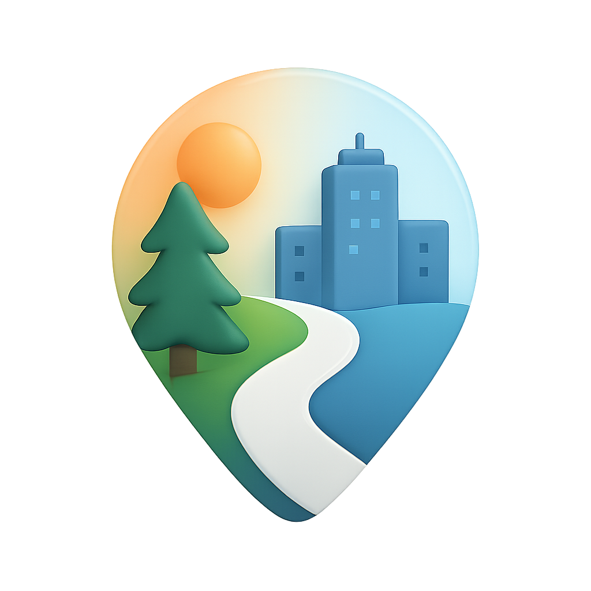
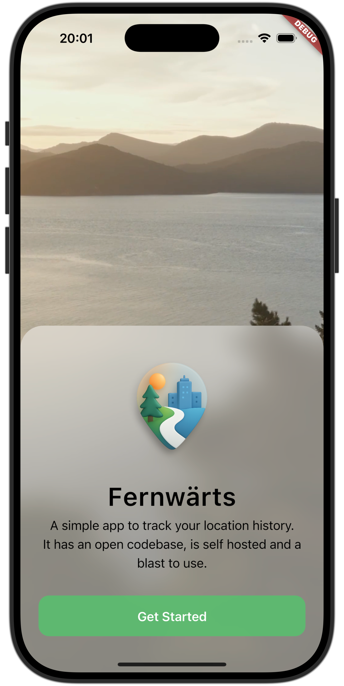
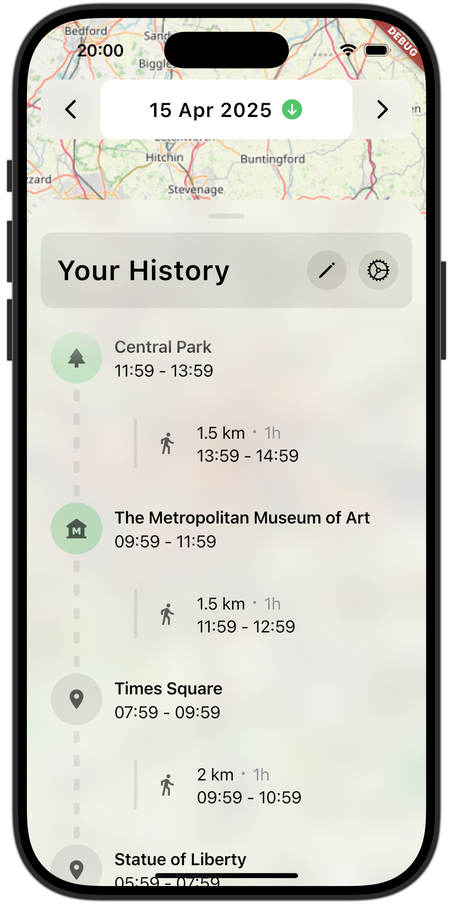

  

<h1 align="center">Fernwärts</h1>

  A privacy-focused, self-hosted location history app powered by Flutter. 
  Open source. Local control. Beautiful insights.

  
  
  

  <a href="https://fernwaerts.eu">Homepage</a> • 
  <a href="https://sites.plane.so/issues/fbbc1b7173c046db81991272b8f43259">Planning</a> • 
  <a href="https://www.fernwaerts.eu/docs">Documentation</a>

---

### 📸 Screenshots

  
  
  

---

### ✨ Features

- **Privacy First**: Data is stored locally or on your self-hosted Supabase
  instance
- **Smart Location Insights**: Detects and categorizes visits by place, city,
  and country
- **Activity Recognition**: Knows whether you’re walking, biking, driving, or
  just chilling
- **Cross-Platform (Flutter)**: Currently supports **iOS** and **Android**
  > 🚧 Desktop (macOS, Linux and Windows) and Web support are on the roadmap and
  > coming soon

---

### 📥 Download

Coming soon for **iOS** and **Android**. Star the repo to stay updated :)

> Desktop and Web versions are in development and will be released shortly
> after.

---

### ⚙️ Getting Started with the Server

While we work on a dedicated setup page, devs can jump right in using the
[Contributing Guide](CONTRIBUTING.md).

Includes setup for:

- Flutter app with flavors
- Supabase backend (self-hosted)
- Optional AI-assisted coding tools

---

### 📚 Documentation

Work-in-progress docs are available at\
👉 [https://fernwaerts.eu](https://fernwaerts.eu)

---

### 🤝 Contributing

Pull requests are welcome!\
See the [Contributing Guide](CONTRIBUTING.md) for setup instructions, commit
guidelines, and project structure.

---

### 📝 License

This project is licensed under the **AGPL-3.0** license (see [LICENSE](LICENSE))

### 💡 Your Journey, Your Data – Open, Private, Yours.
