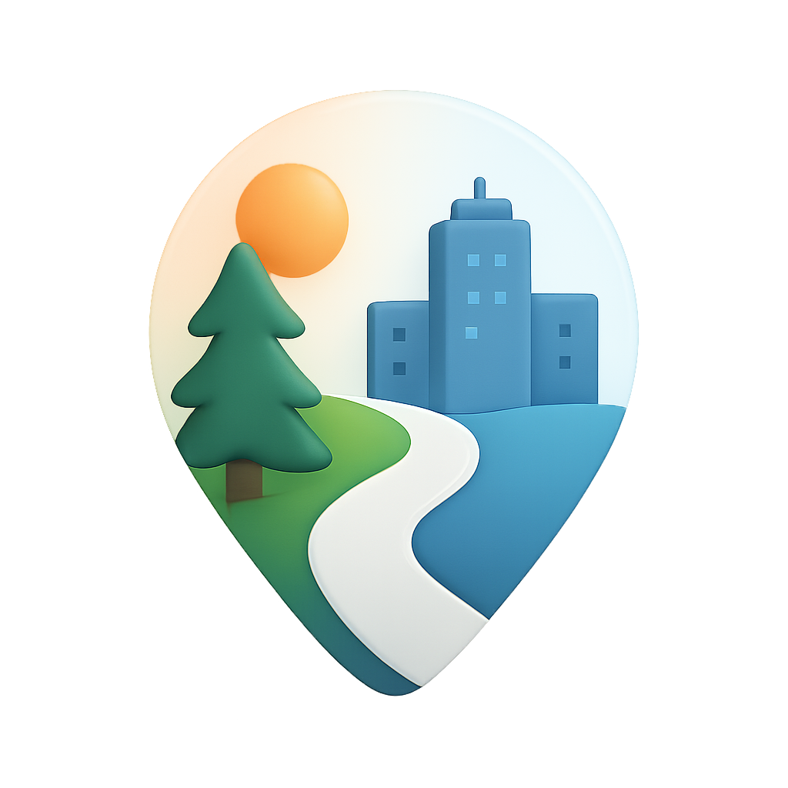
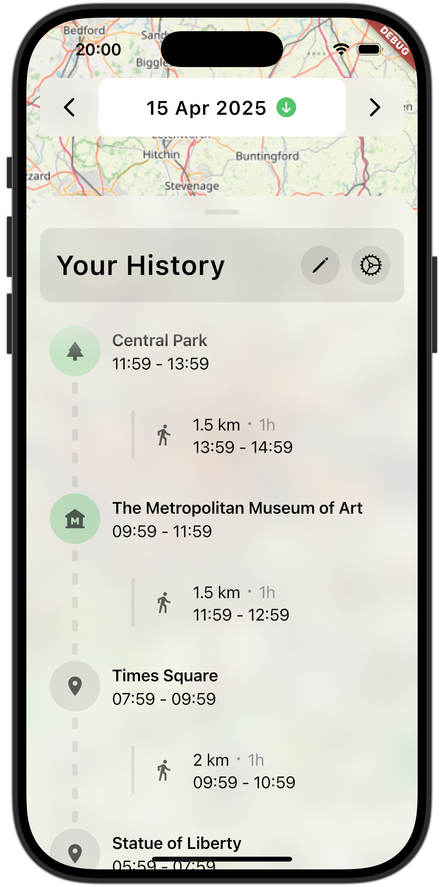

  

<h1 align="center">Fernwärts</h1>

A privacy-focused Flutter application that tracks your location history. It has an open codebase, is self hosted and a blast to use.

  
  
  

## Features

- **Privacy First**: Your data remains under your control, whether used locally or self-hosted
- **Smart Insights**: Automatically categorizes visits by place, city, and country
- **Activity Recognition**: Identifies walking, cycling, running, and driving
- **Multi-platform**: Available for iOS, Android, macOS, Linux, and Web

## Downloading the App

Coming very soon!

## Getting Started (with the Server)

Coming very soon!

## Documentation

Comprehensive documentation is available at our [documentation site](https://ton-an.github.io/fernwaerts/). (In very early stages)

## Contributing

I welcome contributions. A contributor guide will be added soon.

## License
This project is dual-licensed:
- **MIT License** for general use, modification, and distribution.
- **Proprietary License** that reserves the exclusive right to publish on the **Google Play Store** and **Apple App Store** to the original author (Anton Heuchert).

Publishing to any other store, such as **AltStore**, **Aptoide**, or similar alternative platforms, is explicitly allowed under the MIT License.

By using this software, you agree to comply with both licenses. See `LICENSE` and `LICENSE.store` for full details.

**Your Journey, Your Data – Open, Private, Yours.**